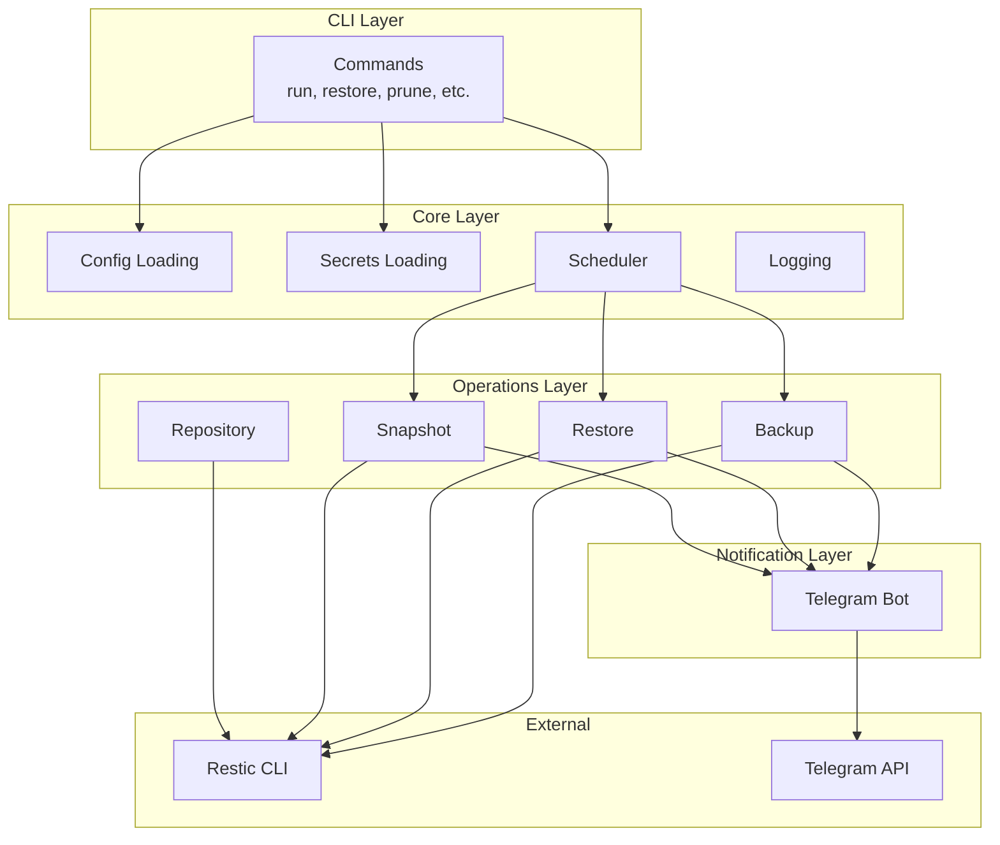
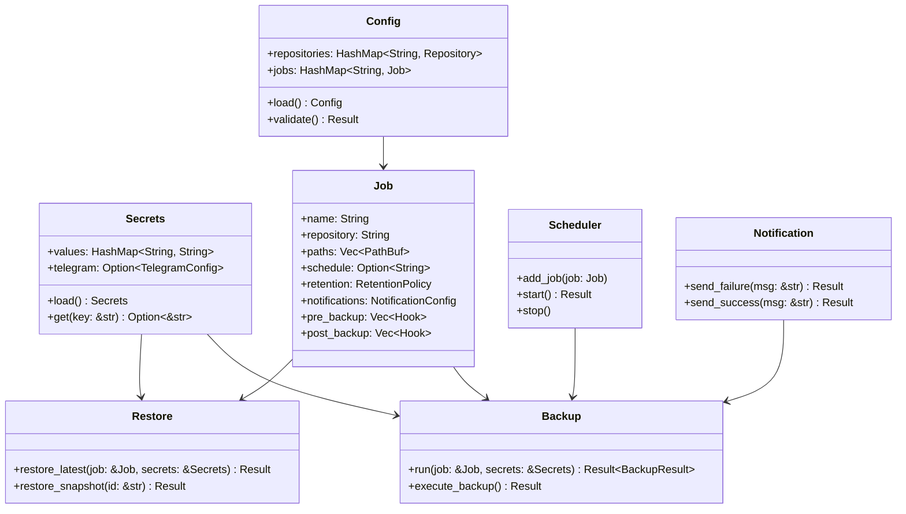
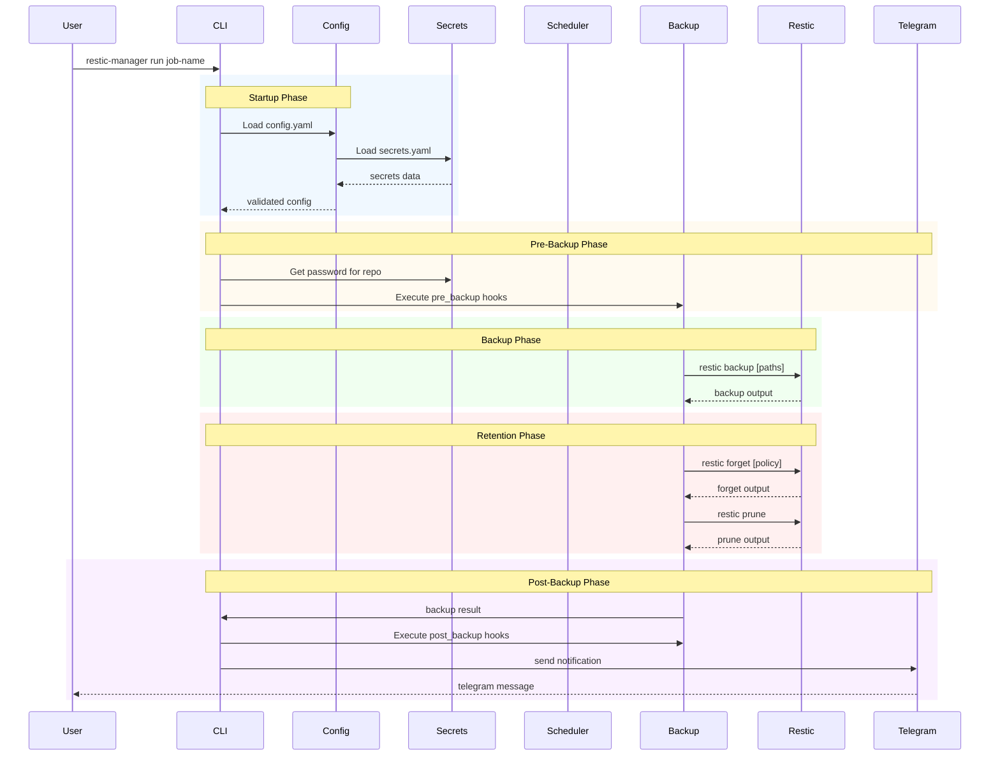
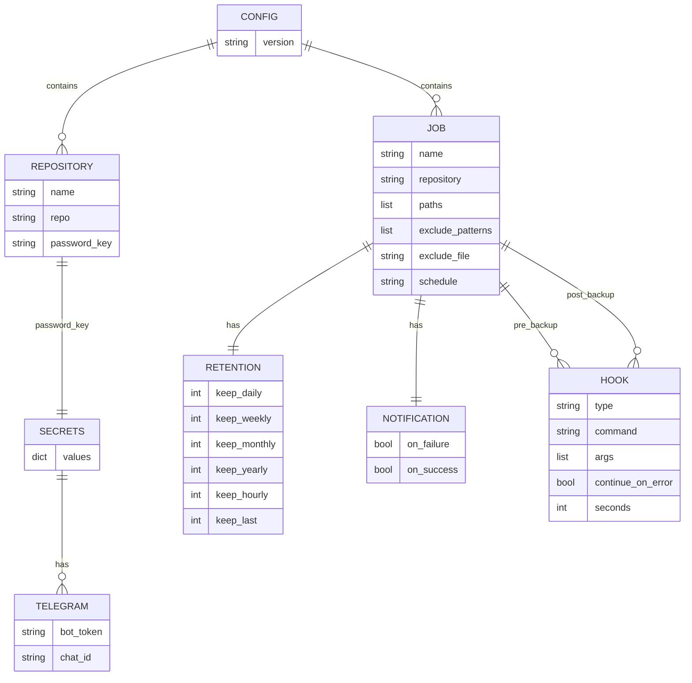

# Restic Manager - Design Document

## Overview

A CLI tool for simplifying configuration and management of restic backups with built-in scheduling and notifications.

## Architecture



## Module Structure



## Data Flow



## Configuration Model



## Interface

### CLI Commands

```
restic-manager run <job>         # Run backup job now
restic-manager restore <job> --target <dir>    # Restore latest snapshot
restic-manager restore <job> --snapshot <id> --target <dir>
restic-manager prune <job>      # Run prune with retention
restic-manager list <job>       # List snapshots for job
restic-manager check <job>      # Check repository integrity
restic-manager unlock <job>     # Unlock stuck processes
restic-manager daemon           # Run scheduler in foreground
restic-manager job list         # List all configured jobs
restic-manager job add <file>   # Add job from file
restic-manager init <repo>      # Initialize repository
```

## Configuration

### Directory Structure

```
~/.config/restic-manager/
├── config.yaml    # Main configuration
└── secrets.yaml   # Sensitive data (gitignored)
```

### config.yaml Schema

```yaml
repositories:
  <name>:
    repo: <restic-repo-path>
    password_key: <key-in-secrets>

jobs:
  <job-name>:
    repository: <repository-name>
    paths:
      - /path/to/backup
    exclude_patterns:
      - "*.tmp"
      - ".cache/**"
    schedule: "<cron-expression>"
    retention:
      keep_daily: 7
      keep_weekly: 4
      keep_monthly: 6
    notifications:
      on_failure: true
      on_success: false
    pre_backup:
      - type: Command
        command: <binary>
        args: ["arg1", "arg2"]
        continue_on_error: false  # default; abort the backup if this hook fails
      - type: Wait
        seconds: <seconds>
    post_backup:
      - type: Command
        command: <binary>
        args: ["arg1", "arg2"]
```

### secrets.yaml Schema

```yaml
<key>: <value>
telegram:
  bot_token: <token>
  chat_id: <chat-id>
s3_access_key: <key>
s3_secret_key: <secret>
```

Stored plaintext, so file permissions must be `0600` (owner-only). `Secrets::load`/`load_optional`
warn (but don't fail) if the file is more permissive than that.

## Module Design

### src/cli.rs

- Clap-based CLI with subcommands
- Shell completion support
- Colored output for errors/warnings

### src/config.rs

- Load and validate config.yaml
- Load secrets.yaml (gitignored)
- Resolve password_key references
- Validate job configurations

### src/repository.rs

- `init` - Initialize new repository
- `check` - Verify repository integrity
- `unlock` - Remove stale locks
- `cat` - Read files from repo

### src/backup.rs

- Execute `restic backup` with paths and exclusions
- Run pre_backup commands
- Handle stdout/stderr capture
- Report exit code and output summary

### src/restore.rs

- `restore_latest` - Restore most recent snapshot
- `restore_snapshot` - Restore specific snapshot
- Options: restore to original path, specific path, or stdin

### src/snapshot.rs

- `list` - List snapshots with filters
- `forget` - Remove snapshots by retention policy
- `prune` - Run prune after forget

### src/scheduler.rs

- Parse cron expressions using `cron` crate
- Tokio-based async scheduler
- Job queue with concurrency control
- Graceful shutdown handling

### src/notification.rs

- Telegram bot integration
- Send messages on job completion/failure
- Include job name, status, error details
- Rate limiting to prevent spam

### src/errors.rs

- Custom error types using thiserror
- ConfigError, ResticError, NotificationError
- Display impl for user-friendly messages

### src/logging.rs

- Tracing-based structured logging
- File rotation for logs
- Log levels: error, warn, info, debug

## Execution Flow

1. **Startup**: Load config + secrets, validate, setup logging
2. **Run Job**:
   - Load env vars from secrets
   - Run pre_backup commands (skipped in `--dry-run` - they can have side effects like DB dumps or service stops)
   - Execute restic backup
   - Run restic forget (retention)
   - Run restic prune (optional)
   - Run post_backup commands (also skipped in `--dry-run`)
   - Send notification
   - Log results

## Dependencies

```toml
clap = { version = "4", features = ["derive"] }
serde = { version = "1", features = ["derive"] }
serde_yaml = "0.9"
tokio = { version = "1", features = ["full"] }
chrono = { version = "0.4", features = ["serde"] }
cron = "0.15"
tracing = "0.1"
tracing-subscriber = "0.3"
reqwest = { version = "0.12", features = ["json"] }
thiserror = "2"
dirs = "6"
```

## Implementation Phases

### Phase 1: Foundation

- Project setup with dependencies
- Error types
- Config and secrets loading
- Basic CLI structure

### Phase 2: Repository Operations

- Init, check, unlock commands
- Test repository connectivity

### Phase 3: Backup/Restore

- Backup execution
- Restore functionality
- Pre/post backup hooks

### Phase 4: Snapshot Management

- List snapshots
- Retention policies
- Prune operations

### Phase 5: Scheduler

- Cron parsing
- Daemon mode
- Job execution

### Phase 6: Notifications

- Telegram integration
- Failure/success messages

## Security Considerations

- secrets.yaml must be in .gitignore
- Never log passwords or secrets
- Use env vars for passwords (set from secrets at runtime)
- Validate repository paths to prevent directory traversal
