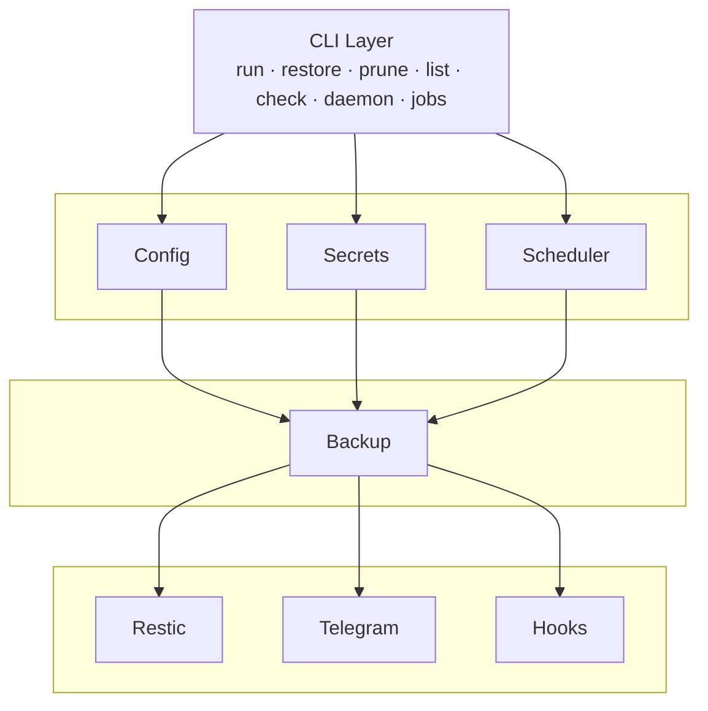

# restic-manager


> CLI tool for managing restic backups with scheduling and notifications

`restic-manager` simplifies backup management by providing a unified interface to configure jobs, schedule backups with cron, and receive notifications via Telegram.

## Features

- **Job-based backup management** — Define backup jobs in YAML with paths, exclusions, and retention policies
- **Scheduled execution** — Run backups automatically via cron expressions
- **Telegram notifications** — Get notified on job success or failure
- **Pre/post backup hooks** — Run custom commands before or after backups
- **Retention policies** — Automatic snapshot pruning with configurable keep rules
- **Multiple repositories** — Manage multiple restic repositories from one config

## Quick Start

### Prerequisites

- [restic](https://restic.net/) installed and in PATH
- Rust 1.75+

### Build

```bash
cargo build --release
```

### Configuration

Create `~/.config/restic-manager/config.yaml`:

```yaml
repositories:
  local:
    repo: /backup/my-repo
    password_key: restic-password

jobs:
  documents:
    repository: local
    paths:
      - /home/user/documents
    exclude:
      - "*.tmp"
      - ".cache/**"
    schedule: "0 2 * * *"  # 2 AM daily
    retention:
      keep-daily: 7
      keep-weekly: 4
      keep-monthly: 6
    notifications:
      on_failure: true
      on_success: false
```

Create `~/.config/restic-manager/secrets.yaml` (gitignored):

```yaml
restic-password: your-secret-password
telegram:
  bot_token: your-bot-token
  chat_id: your-chat-id
```

### Usage

```bash
# Run a backup job
restic-manager run documents

# Restore latest backup
restic-manager restore documents

# Restore specific snapshot
restic-manager restore documents --snapshot abc123

# List snapshots
restic-manager list documents

# Check repository integrity
restic-manager check documents

# Prune old snapshots
restic-manager prune documents

# Start scheduler daemon
restic-manager daemon

# List configured jobs and repositories
restic-manager jobs
restic-manager repos

# Initialize a new repository
restic-manager init local
```

## Configuration Reference

### config.yaml

| Field                            | Description                                 |
| -------------------------------- | ------------------------------------------- |
| `repositories.<name>.repo`         | Restic repository path                      |
| `repositories.<name>.password_key` | Key in secrets.yaml for repository password |
| `jobs.<name>.repository`           | Repository name to use                      |
| `jobs.<name>.paths`                | List of paths to backup                    |
| `jobs.<name>.exclude`              | Patterns to exclude                         |
| `jobs.<name>.schedule`             | Cron expression for scheduling             |
| `jobs.<name>.retention`            | Snapshot retention policy                   |
| `jobs.<name>.notifications`        | Notification preferences                    |
| `jobs.<name>.pre_backup`           | Commands to run before backup               |
| `jobs.<name>.post_backup`          | Commands to run after backup                |

### secrets.yaml

| Field              | Description                                          |
| ------------------ | ---------------------------------------------------- |
| `<key>`            | Arbitrary key-value pairs referenced by password_key |
| `telegram.bot_token` | Telegram bot token                                   |
| `telegram.chat_id`   | Telegram chat ID for notifications                   |

## Development

```bash
cargo build
cargo test
cargo clippy --all-targets --all-features -- -D warnings
cargo fmt
```

## Architecture



## License

MIT
