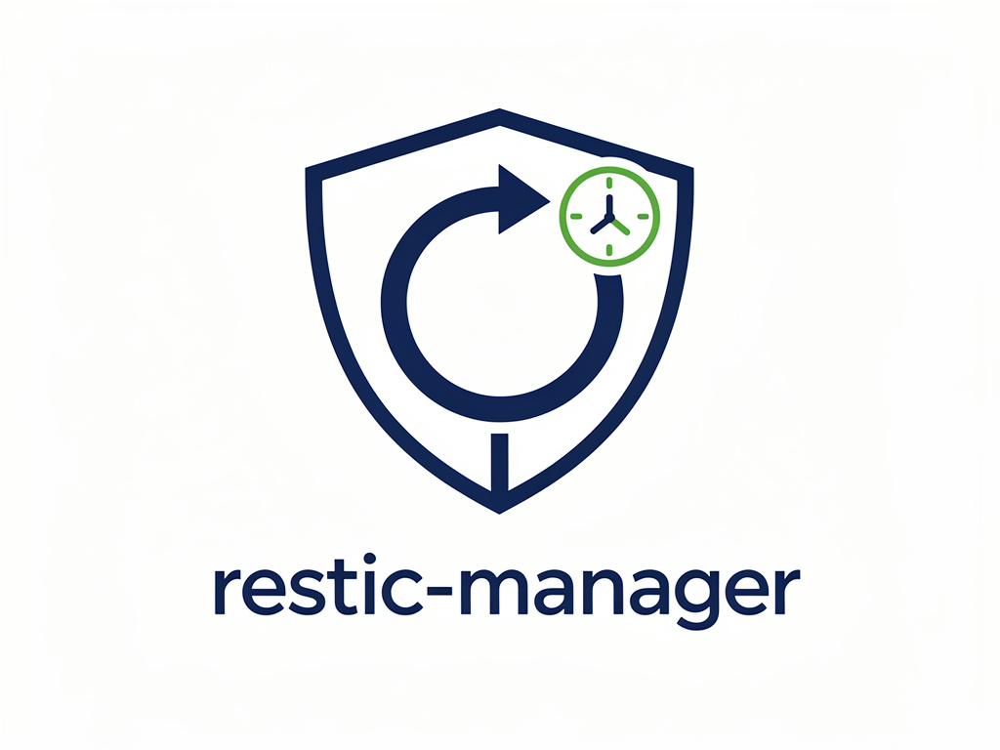
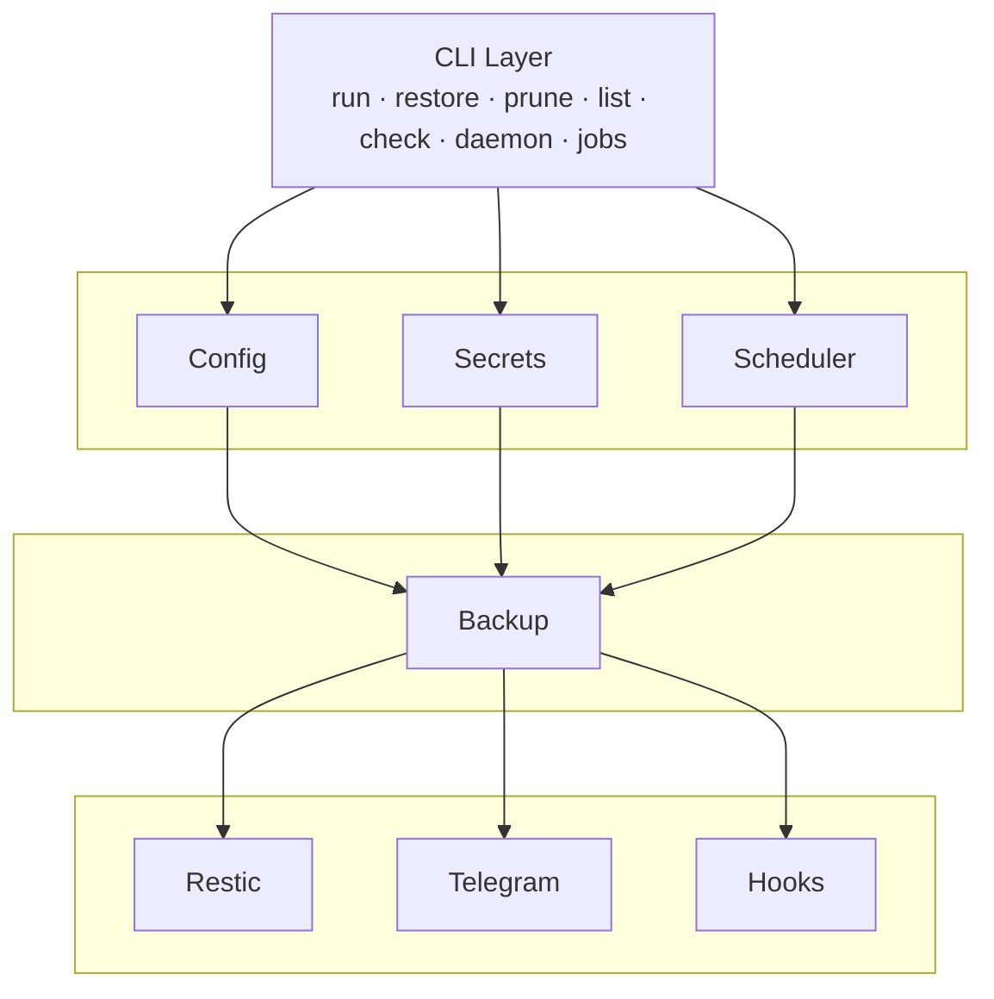

# Restic Manager

<picture>
 
</picture>

---

<!-- License -->


<!-- Made With Rust -->


<!-- Workflow -->
![Latest][Latest] ![Contributors][Contributors] ![Open PRs][Open PR]
[![Build][Build-svg]][Build-Workflow] [![Tests][Test-svg]][Test-Workflow] [![PR
Review][PR-Review-svg]][PR-Review-Agent] [![Coverage][Coverage-svg]][Coverage-Workflow]

<!-- Badge Link References -->
[Latest]: https://badgen.net/github/tag/gdellis/restic-manager
[Contributors]: https://badgen.net/github/contributors/gdellis/restic-manager
[Open PR]: https://badgen.net/github/open-prs/gdellis/restic-manager

[Build-svg]: https://github.com/gdellis/restic-manager/actions/workflows/build.yml/badge.svg
[Build-Workflow]: https://github.com/gdellis/restic-manager/actions/workflows/build.yml
[Test-svg]: https://github.com/gdellis/restic-manager/actions/workflows/test.yml/badge.svg
[Test-Workflow]: https://github.com/gdellis/restic-manager/actions/workflows/test.yml

[PR-Review-svg]: https://github.com/gdellis/restic-manager/actions/workflows/pr_agent.yml/badge.svg
[PR-Review-Agent]: https://github.com/gdellis/restic-manager/actions/workflows/pr_agent.yml

[Coverage-svg]: https://github.com/gdellis/restic-manager/actions/workflows/coverage.yml/badge.svg
[Coverage-Workflow]: https://github.com/gdellis/restic-manager/actions/workflows/coverage.yml

---

> CLI tool for managing restic backups with scheduling and notifications

`restic-manager` simplifies backup management by providing a unified interface
to configure jobs, schedule backups with cron, and receive notifications via
Telegram.

## Features

- **Job-based backup management** — Define backup jobs in YAML with paths,
  exclusions, and retention policies
- **Scheduled execution** — Run backups automatically via cron expressions
- **Telegram notifications** — Get notified on job success or failure
- **Pre/post backup hooks** — Run custom commands before or after backups
- **Retention policies** — Automatic snapshot pruning with configurable keep
  rules
- **Multiple repositories** — Manage multiple restic repositories from one
  config

## Quick Start

### Prerequisites

- [restic](https://restic.net/) installed and in PATH
- Rust 1.75+

### Build

```bash
cargo build --release
```

### Configuration

Create `~/.config/restic-manager/config.yaml`:

```yaml
repositories:
  local:
    repo: /backup/my-repo
    password_key: restic-password

jobs:
  documents:
    repository: local
    paths:
      - /home/user/documents
    exclude_patterns:
      - "*.tmp"
      - ".cache/**"
    schedule: "0 2 * * *"  # 2 AM daily
    retention:
      keep_daily: 7
      keep_weekly: 4
      keep_monthly: 6
    notifications:
      on_failure: true
      on_success: false
    pre_backup:
      - type: Command
        command: /usr/local/bin/db-dump.sh
        args: []
        continue_on_error: false  # abort the backup if this hook fails (default)
```

Create `~/.config/restic-manager/secrets.yaml` (gitignored):

```yaml
restic-password: your-secret-password
telegram:
  bot_token: your-bot-token
  chat_id: your-chat-id
```

This file holds plaintext repository passwords and your Telegram bot token, so restrict it to your
own user (`chmod 600 ~/.config/restic-manager/secrets.yaml`). `restic-manager` warns at startup if
it detects the file is readable or writable by group or others.

### Usage

```bash
# Run a backup job
restic-manager run documents

# Restore latest backup (--target is required to avoid accidentally
# overwriting the current directory)
restic-manager restore documents --target /path/to/restore

# Restore specific snapshot
restic-manager restore documents --snapshot abc123 --target /path/to/restore

# List snapshots
restic-manager list documents

# Check repository integrity
restic-manager check documents

# Prune old snapshots
restic-manager prune documents

# Start scheduler daemon
restic-manager daemon

# List configured jobs and repositories
restic-manager jobs
restic-manager repos

# Initialize a new repository
restic-manager init local
```

## Configuration Reference

### config.yaml

| Field | Description |
| --- | --- |
| `repositories.<name>.repo` | Restic repository path |
| `repositories.<name>.password_key` | Key in secrets.yaml for repository password |
| `jobs.<name>.repository` | Repository name to use |
| `jobs.<name>.paths` | List of paths to backup |
| `jobs.<name>.exclude_patterns` | List of exclude patterns, written to a per-job exclude file |
| `jobs.<name>.exclude_file` | Path to an existing exclude file; takes precedence over `exclude_patterns` |
| `jobs.<name>.schedule` | Cron expression for scheduling |
| `jobs.<name>.retention` | `keep_daily`/`keep_weekly`/`keep_monthly`/`keep_yearly`/`keep_hourly`/`keep_last` |
| `jobs.<name>.notifications` | `on_failure`/`on_success` |
| `jobs.<name>.pre_backup` | Hooks to run before backup (skipped in `--dry-run`) |
| `jobs.<name>.post_backup` | Hooks to run after backup (skipped in `--dry-run`) |
| hook `continue_on_error` | If `true`, a failing hook warns and continues; default `false` aborts the backup |

### secrets.yaml

| Field              | Description                                          |
| ------------------ | ---------------------------------------------------- |
| `<key>`            | Arbitrary key-value pairs referenced by password_key |
| `telegram.bot_token` | Telegram bot token                                   |
| `telegram.chat_id`   | Telegram chat ID for notifications                   |

## Development

```bash
cargo build
cargo test
cargo clippy --all-targets --all-features -- -D warnings
cargo fmt
cargo coverage
```

## Architecture



## License


MIT
